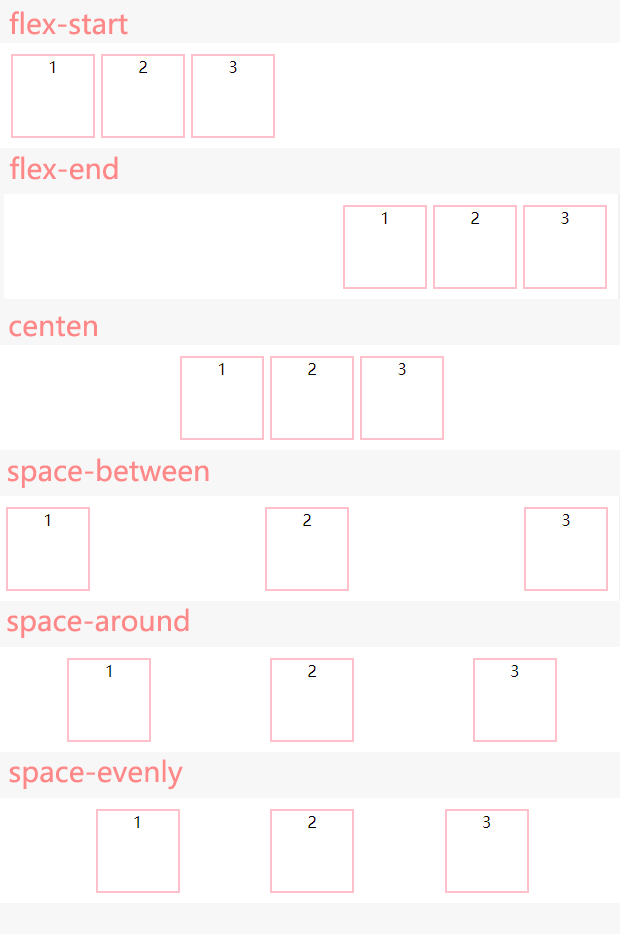
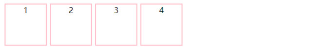
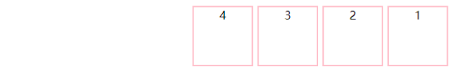
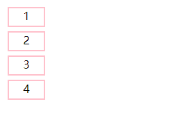

# Flex 布局

## [一、什么是 Flex 布局？]()


## 一、什么是 Flex 布局？

Flex 布局就是 Flexible Box 的缩写，意为 " 弹性布局 "，用来为盒状模型提供最大的灵活性。

任何一个容器都可以指定为 Flex 布局。
```
    .box{
    display: flex;
    }
```
 
不同于 float 的一点是，行内元素也可以使用 Flex 布局
```
    .box{
    display: inline-flex;
    }
```

Webkit 内核的浏览器，必须加上 -webkit 前缀。

```
    .box{
        display: -webkit-flex;
        display:flex;
    }
```
注意，设为 Flex 布局以后，子元素的float、clear和vertical-align属性将失效。

## 二、Flex 布局基本概念
采用 Flex 布局的元素，称为 Flex 容器，容器下面的子元素自动成为容器成员,统称为 Flex 项目，简称"项目"。

### 主轴与交叉轴
容器默认有两根轴用于定位：水平的主轴（main axis）与垂直的交叉轴（cross axis）。主轴开始的位置与边框相连的位置叫 main start ，结束的位置叫 main end ，交叉轴开始的位置叫 cross start，结束的位置叫 cross end。  

项目默认沿主轴顺序排列，单个项目占据的主轴空间称为 main size，占据的交叉轴空间叫做 cross size。

 </img>

## 三、容器的属性
Flex容器有以下6个属性：
 * flex-direction
 * flex-wrap
 * flex-flow
 * justify-content
 * align-items
 * align-content

### 3.1（ flex-direction 属性 )

flex-direction 属性决定主轴的方向（即项目的排列方向），该属性有四个值：
* row（默认值）：主轴为水平方向，起点在左端。
* row-reverse：主轴为水平方向，起点在右端。
* column：主轴为垂直方向，起点在上沿。
* column-reverse：主轴为垂直方向，起点在下沿。

### 3.2（ flex-wrap 属性 )

flex-wrap 属性控制项目是否换行及如何换行，该属性有三个值
* flex-wrap: nowrap 默认值不换行。
* flex-wrap: wrap 换行，第一行在上方。
* flex-wrap: wrap-reverse 换行，第一行在下方。

### 3.3（ flex-flow 属性 )

flex-flow 属性是 flex-direction 属性和 flex-wrap 属性的简写方式。默认值为 row nowrap。

### 3.4（ justify-content 属性 ）

justify-content 属性决定项目在主轴的对齐方式，该属性有五个值
* flex-start（默认值）：左对齐
* flex-end：右对齐
* center： 居中
* space-between：两端对齐，项目之间的间隔都相等。
* space-around：每个项目两侧的间隔相等。所以，项目之间的间隔比项目与边框的间隔大一倍。

效果如下图：

 </img>

## 四、flex-direction 属性实战应用  

### 4.1（ flex-direction:row 属性 ）
 从左到右排列也是 flex-direction 的默认值，效果如下：

 </img>

### 4.2（ flex-direction:row-reverse 属性 ）
 从右到左排列，效果如下：

 </img>


### 4.3（ flex-direction:column 属性 ）
从上到下排列，效果如下：

 </img>

### 4.4（ flex-direction:column-reverse 属性 ）
从下到上排列，效果如下：

 </img>

#### 注意点：
当父容器的宽度或者高度不够的时候，每一个项目会相应收缩宽高，如果设置了宽高，项目自缩小扔无法被父容器包裹，那么按照排列顺序终点方向超出容器。