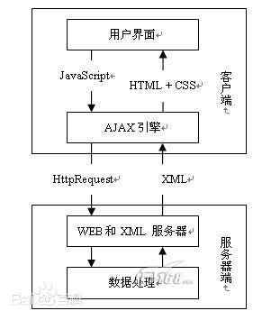

# 学习 Ajax 总结

- [关于 学习 Ajax 总结]()
  - [一、什么是 Ajax ](#一什么是-ajax)
    - [1.Ajax 工作原理](#1ajax-工作原理)
  - [二、Ajax 的优缺点](#二ajax-的优缺点)
    - [1.优点](#1优点)
    - [2.缺点](#2缺点)
  - [三、Ajax 注意点及适用和不适用场景](#三ajax-注意点及适用和不适用场景)
    - [1.适用场景](#1ajax-适用场景)
    - [2.不适用场景](#2ajax-不适用场景)
  - [四、XMLHttpRequest 对象](#四xmlhttprequest-对象)

## 一、什么是 Ajax 
Ajax 不是一种新的编程语言，而是一种用于创建更好更快以及交互性更强的 Web 应用程序的技术。它依赖于 JavaScript，所以可能会有浏览器不支持。

### （1.Ajax 工作原理）
Ajax 的工作原理相当于在用户和服务器之间加了一个中间层( AJAX 引擎),使用户操作与服务器响应异步化，并不是所有的用户请求都提交给服务器,像—些数据验证和数据处理等都交给 Ajax 引擎自己来做, 只有确定需要从服务器读取新数据时再由 Ajax 引擎代为向服务器提交请求。   
 </img>

## 二、Ajax 的优缺点
### (1.优点) 
 * Ajax 可使因特网应用程序更小、更快，更友好。
 * Ajax 在对页面的使用异步数据传输（HTTP 请求）到Web 服务器，然后服务器在后台处理请求。
 * Ajax 是一种独立于 Web 服务器软件的浏览器技术。
 * Ajax 能在不更新整个页面的情况下维护数据。
 * Ajax 不需要插件，但需要用户允许 JavaScript 在浏览器中执行，所以如果有浏览器不支持，搜索引擎的蜘蛛程序不会抓取到有关内容，随着 Ajax 的成熟，一些简化 Ajax使用方法的程序库也相继问世，同样，也出现了另一种辅助程序设计的技术，为那些不支持 JavaScript 的用户提供替代功能。

### （2.缺点）
 * AjaX 破坏了 Back 和 History 功能，即对浏览器机制的破坏
 * Ajax 技术就如同对企业数据建立了一个直接通道，这使得开发者在不经意间会暴露更多的数据和服务器逻辑。
 * 对搜索引擎的支持比较弱，如果使用不当，AJAX会增大网络数据的流量，从而降低整个系统的性能。
 * 违背 URL 和资源定位的初衷。
 * Ajax 不能很好支持移动设备。
 * 客户端过肥，太多客户端代码造成开发上的成本。

## 三、Ajax 注意点及适用和不适用场景
Ajax 开发时，网络延迟 —— 即用户发出请求到服务器发出响应之间的间隔 —— 需要慎重考虑。不给予用户明确的回应，没有恰当的预读数据，或者对 XMLHttpRequest 的不恰当处理，都会使用户感到延迟，这是用户不希望看到的，也是他们无法理解的。通常的解决方案是，使用一个可视化的组件来 告诉用户系统正在进行后台操作并且正在读取数据和内容。

### （1.Ajax 适用场景)
 * 表单驱动的交互。
 * 深层次的树的导航。
 * 快速的用户与用户间的交流响应。
 * 类似投票 yes/no 等无关痛痒的场景。
 * 对数据进行过滤和操纵相关数据的场景。
 * 普通的文本输入提示和自动完成的场景。

### （2.Ajax 不适用场景）
 * 部分简单的表单
 * 搜索
 * 基本的导航
 * 替换大量的文本
 * 对呈现的操纵

## 四、XMLHttpRequest 对象
Ajax 技术核心就是 XMLHttpRequest 对象，JavaScript可以通过它，自己发送请求，自己处理请求响应。

具体实例： [ Ajax ](/javascript/javascript-dom-编程的艺术/ajax.html)

