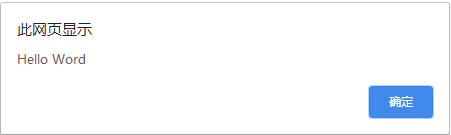
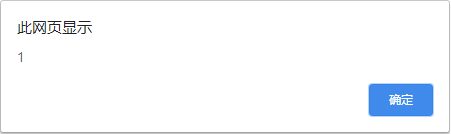

# 关于 JS 学习一天的总结
- [关于 JS 学习一天的总结](#关于-js-学习一天的总结)
  - [一、DOM 简介](#一dom-简介)
    - [（1.DOM 是什么）](#1dom-是什么)
    - [（2.DHTML 是什么）](#2dhtml-是什么)
    - [（3.DOM 发展历史）](#3dom-发展历史)
  - [二、对象](#二对象)
    - [（1.内建对象）](#1内建对象)
    - [（2.宿主对象）](#2宿主对象)
  - [三、节点](#三节点)
    - [（1.元素节点）](#1元素节点)
    - [（2.文本节点）](#2文本节点)
    - [（3.属性节点）](#3属性节点)
  - [四、获取元素](#四获取元素)
    - [（1. getElementById 方法）](#1-getelementbyid-方法)
    - [（2.getElementsByTagName 方法）](#2getelementsbytagname-方法)
    - [（3.getElementsByClassName 方法）](#3getelementsbyclassname-方法)
  - [总结：](#总结)

## 一、DOM 简介
JavaScript 初期还提供了一种初级的 DOM，下面让我们一起来看看什么是 DOM 吧。 

### （1.DOM 是什么）
DOM 是一套对文档内容进行抽象和概念化的方法。

### （2.DHTML 是什么）
DHTML (动态 HTML )描述 HTML、CSS、JavaScript 技术组合的术语。   
含义：
 * 利用 HTML 把网页标记为各种元素
 * 利用 CSS 设置元素样式和它们显示位置
 * 利用 JavaScript 实时的对页面进行控制和更改样式

### （3.DOM 发展历史）
关于 DOM 的发展历程，我们不得不提起一个哥们 Brendan Eich ( 布兰登 · 艾奇 )，这哥们用了十天开发出了 JavaScript ，关于 JavaScript 的发展历史可以看我的一篇文章  [JS 简介](./../01-JS%20简介.md) 。

## 二、对象
对象是一种非常重要的数据类型，对象是自包含的数据集合，通过两种形式访问分别是 属性 和 方法，文档中每个元素都是一个对象。
* 属性：某个特定对象的变量
* 方法：某个特定对象的才能调用的特定函数

### （1.内建对象）
内建对象其实就是 JavaScript 中已经创建但未初始化的对象。就比如我们最常见的数组

``` JavaScript
    Var arr = new Array();  
```

当我们使用 new 关键字去初始化数组的时候，就是相当于在创建一个 Array 对象的实例了。

### （2.宿主对象）
由浏览器预定义的对象被称为宿主对象，宿主对象包括 Form、Image、Element等，我们最常见的宿主对象就是 document 对象。

## 三、节点
关于节点我们看看 DOM 的概念，首先来分解下其词语， D 就是文档，O对应这对象，M对应模型，文档是由节点构成的集合，下面来看看是三种最常用的节点。

### （1.元素节点）
DOM 的原子是元素节点，标签的名字叫就是元素的名字，每个元素所在的位置构成的文档的结构。

``` JavaScript
    <p></p> //这是一个标签，也可以说是一个元素。
```


### （2.文本节点）
文本节点被包含在元素节点的内部，例如元素 < p > 包含的文本内容 “ Hello Word ” ，他就是一个文本节点。

``` JavaScript
    <p> Hello Word </p> //文本的内容就是的内容
```

### （3.属性节点）
属性节点用来对元素做出更具体的描述，被包含在元素节点内部。

``` JavaScript
    <p style="color:red"; > Hello Word </p>
```

## 四、获取元素
有三种方法可以获取 DOM 元素节点。

### （1. getElementById 方法）
我们首先创建一个 p 元素，然后给元素创建一个 id 值，用 getElementById 方法获取元素的文本节点。
``` JavaScript

        <p id="box">Hello Word</p>
    <script>
        var a = document.getElementById("box").innerHTML;
        alert(a);
    </script>

```
让我们来看看效果  
</img>  
通过上图我们可以看到成功弹出了 id 为 box 的 p 元素的文本。

### （2.getElementsByTagName 方法）
getElementsByTagName 方法返回的是一个对象数组，参数值是标签的名字

```javascript
    alert(document.getElementsByTagName("p").length);
```
让我们来看看效果  
</img>  
通过上图我们可以看到成功返回了一个数字，他代表 p 元素的数组值。

### （3.getElementsByClassName 方法）
这个方法与 getElementsByTagName 类似，都是返回一个具有相同类名的元素数组，使用此方法还可以查找那些带有多个类名的元素。

## 总结：
 * 一份文档就是一棵节点树
 * getElementById 将返回一个对象，该对象对应着文档里得一个特定饿元素节点
 * getElementsByTagName 和 getElementsByTagName 将返回一个对象数组，分别对应文档里面特定的一组元素节点
 * 每个节点都是一个对象
