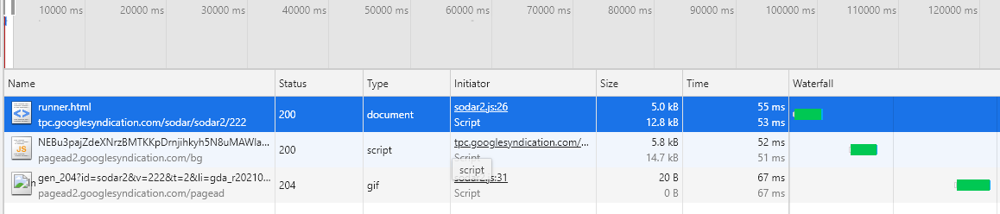

# 高性能建站

关于高性能建站，首先我们要了解，前端性能的重要性与 Web 页面性能时间究竟花在哪里了。 让我们先来了解下前端性能的重要性。

## 前端性能的重要性

 * 如果我们将后端的响应时间缩短一半，整体响应时间提升只有 5% - 10% ，不过如果我们将前端的性能响应时间，同样是缩短一半，但是整体响应时间提升能达到 40% - 50% 。
 * 改进前端只需要较少的时间和资源，减少后端延迟会带来很大的波动 。
 * 前端性能调整已被证明是可行的 。    

看完了前端的重要性，下面我们来看看 Web 页面的性能 。

## 关于 Web 页面性能

首先当浏览器 ( 客户端 ) 访问域名时，浏览器会产生 HTTP 流量，每一个横条就是一个 HTTP 请求，第一个横条标有 html、htm，表示是对 HTML 文档初始化的请求，之后再解析 HTML 文件并且等待下载解析的组件。
如下图:  

</img>
我们可以看到请求 HTML 文档所消耗的时间只占 10% ，而其余时间都用在了组件下载上面。

## 时间花在哪里呢？

1.首先从上图我们就可以看出来，基本上 90% 的时间都用在了页面的组件中，但是当我们再次打开该页面会发现，紧跟 HTML 的文档的 HTTP 请求后面是一段空白，也就意味着并没有下载，这是为什么呢？那这段时间在做什么呢？

2.当我们第二次打开浏览器，因为第一次缓存过已经下载的组件所以并没有重新下载组件，但是这段时间在做什么呢？这段时间浏览器正在解析 JavaScript 和 CSS ，并从缓存中获取组件。
 
3.由于浏览器下载脚本是会阻塞额外的 HTTP 请求，所以在请求脚本时不会发送并行请求。

# 性能黄金法则
关于性能黄金法则实际运用可点击下面查看        
* [减少 HTTP 请求](./减少%20HTTP%20请求.md)
* [使用内容发布网络](./使用内容发布网络.md)
* [添加 Expires 头](./添加%20Expires%20头.md)
* [压缩组件](./压缩组件.md)
* [将样式表放在顶部]()
* [将脚本放在底部]()
* [避免 CSS 表达式]()
* [使用外部引入的 JS 和 CSS]()
* [减少 DNS 查找]()
* [精简 JavaScript]()
* [避免重定向]()
* [删除重复脚本]()
* [配置 ETag]()