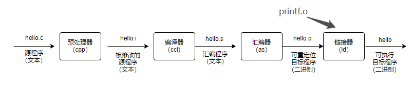

# 深入理解计算机原理

- [关于 《 深入理解计算机原理 》 的总结](#)
  - [一、源文件生命周期](#) 


## 一、源文件生命周期
首先写一个很简单的 C 代码，取名 hello.c ，hello 程序的生命是从一个源文件开始的，然后由程序员通过编辑器创建并保存为文件,源程序实际上是由 0 和 1 组成的位（比特）序列，这些位被组织成 8 个一组，称为字节。
```c
#include <stdio.h>

int main()
{
    printf("hello,world\n");
}

```

 hello.c 表示方法说明了一个基本的思想：系统中所有的信息 —— 包括磁盘文件、存储器重的程序、存储器重存放的用户数据以及网络上传送的数据，都是由一串比特表示的。

## 二、编译系统的构成
编译系统的构成分为：预处理阶段、编译器、汇编器、链接器。其顺序如下图：

</img>

### （2.1 什么是预处理器？）
预处理阶段：预处理器根据字符 # 开头的命令， 第一行的 #include <stdio.h> 指令告诉预处理器读取系统头文件 stdio.h 的内容，并把它直接插入到程序文本中去，于是得到另一个通常以 .i 作为文件扩展名的 C 程序。

### （2.2 什么是编译阶段？）
 编译器将文本文件 hello.i 翻译成 hello.s， 它包含一个汇编语言程序，该程序中每条语句都以一种标准的文本格式描述看一条低级机器语言指令。

 ### （2.3 什么是汇编阶段？）
 汇编器将 hello.s 翻译成机器语言s指令，打包成一个可重新定位的目标程序的格式，并将结果保存在目标文件 hello.o 中，它是一个二进制文件，它的字节编码是机器语言而不是字符。

 ### （2.4链接阶段）
 hello 程序调用了 printf 函数，，该函数存在 printf.o 的单独预编译目标文件中，，然后该文件以某种形式存入 hello.o 程序中。链接器就负责处理这种并入。

 